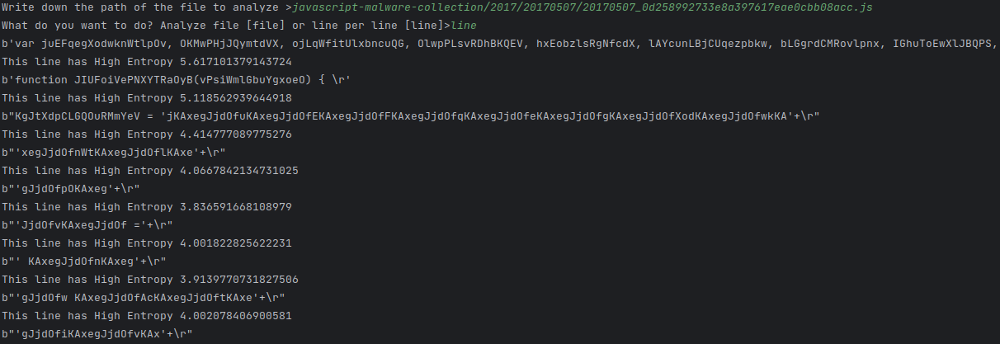

# FREYJA Obfuscation List of Tools

## Javascript Examples to test
git clone https://github.com/HynekPetrak/javascript-malware-collection.git

## Entropy
Based on Shannon Algorithm, I have made this tool in order to analyze files to check the probabilities of a file or the lines of a file to be obfuscated or not.
Usually the obfuscated code returns probability values higher than a **3.75**:
* Use:

```commandline
python entropy.py
```
* Then insert the filename path:
* After that, insert the option to analyse `file` or `line`.





## MBA and OPAQUE examples
* Here we have some examples to test MBA and OPAQUE obfuscation techniques.
