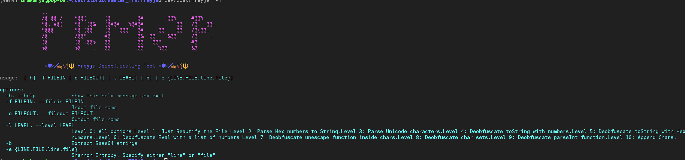
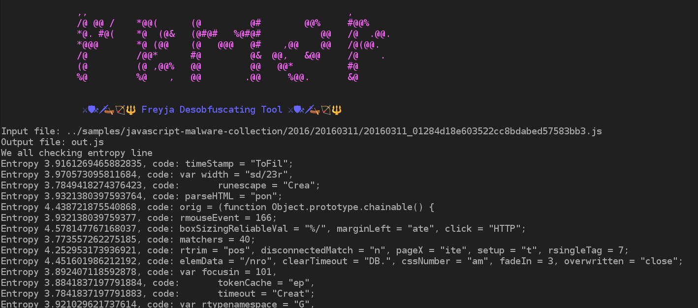
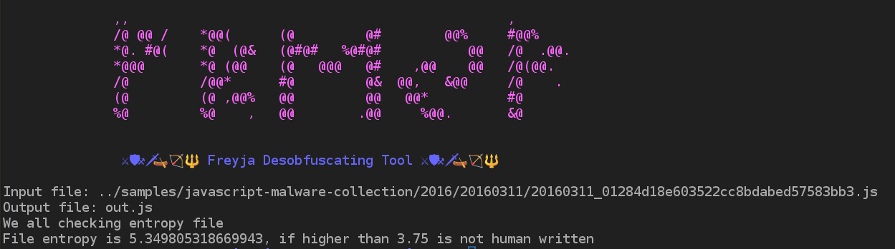

# Freyja Deobfuscation Tool

## Installation

* Creating virtual environment
```bash
cd dev
python3 -m venv venv
source venv/bin/activate
pip3 install -r requirements.txt
```

* We need to have pyinstaller:

```bash
pip install pyinstaller
```

* To create the binary:

```bash
pyinstaller -F freyja.py
```

* Then copy the binary to `/usr/local/bin`

```bash
cp dist/freyja /usr/local/bin/
```

## Usage


### Entropy
* To get Shannon entropy, well use this option:
If we want to see the entropy line per line, we will see lines with an Entropy higher than 3.75, non-human writen.
```commandline
freyja -f filein.js -e line
```


If we want to see the file entropy:
```commandline
freyja -f filein.js -e file
```


### Deobfuscation tool

### Entropy
Based on Shannon Algorithm, I have made this tool in order to analyze files to check the probabilities of a file or the lines of a file to be obfuscated or not.
Usually the obfuscated code returns probability values higher than a **3.75**:

### Javascript Desobfuscation
* To desobfuscate a JavaScript file, we use this command:
```commandline
python freyja -f ./samples/simple_js_malware_code/do_not_run.js -o output.js -l 2
freyja -f ./samples/simple_js_malware_code/do_not_run.js -o output.js -l 2
```
* '-f': File to deobfuscate
* `-o`: The output file, if not, it will be out.js
* `-l`: Set the level 0..10
  * Level 0: All options 
  * Level 1: Just Beautify the File.
  * Level 2: Parse Hex numbers to String.
  * Level 3: Parse Unicode characters.
  * Level 4: Deobfuscate toString with numbers.
  * Level 5: Deobfuscate toString with Hex numbers.
  * Level 6: Deobfuscate Eval with a list of numbers.
  * Level 7: Deobfuscate unescape function inside chars.
  * Level 8: Deobfuscate char sets.
  * Level 9: Deobfuscate parseInt function.
  * Level 10: Append Chars.

## Base64 Search:
* To look for base64 strings and decode them:

```commandline
python freyja -b -f file.js -o output.json 
```

## MBA and OPAQUE examples
* Here we have some examples to test MBA and OPAQUE obfuscation techniques.
